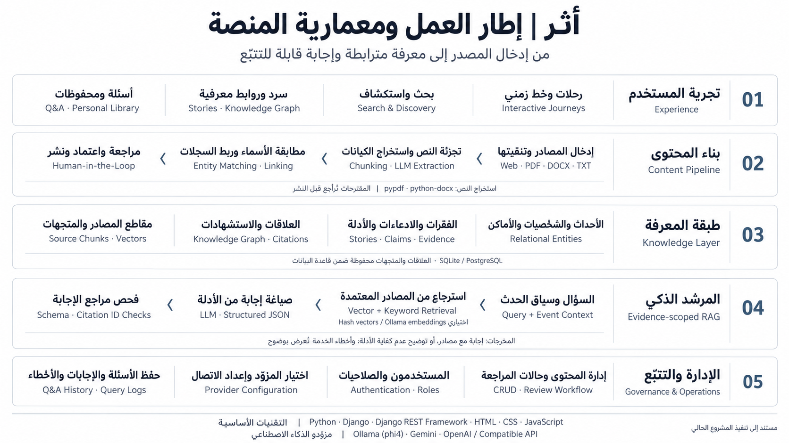

<div align="center">

# أثَر | ATHAR

### لا تقرأ التاريخ فقط… عِش أثره.

منصة عربية لاستكشاف التاريخ الإسلامي عبر السرد القصصي، والعلاقات المعرفية، والمصادر القابلة للتتبّع، ومرشد ذكاء اصطناعي يستند إلى الأدلة المتاحة.

**[جرّب المنصة](https://ai-athar.com/) · [تسجيل الدخول](https://ai-athar.com/login/) · [لوحة الإدارة](https://ai-athar.com/dashboard/)**

Python · Django · REST API · Arabic RTL · Evidence-scoped RAG

</div>

---

## عن المشروع

يجمع **أثَر** بين قراءة التاريخ والتحقق من مصادره في تجربة واحدة. يبدأ الزائر من رحلة أو خط زمني، ويفتح حكاية الحدث، ثم ينتقل من الفقرة إلى استشهادها، ومن الحدث إلى شخصياته وأماكنه. وخلف التجربة، تدير لوحة **أمانة المعرفة** المحتوى والمصادر والمراجعة وخدمات الذكاء الاصطناعي.

**المبدأ:** الذكاء الاصطناعي يقترح ويشرح، والمراجع يعتمد، والمستخدم يستطيع تتبّع الدليل.

## تجربة المنصة وحساب الإدارة

| العنصر | التفاصيل |
|---|---|
| الموقع المباشر | [ai-athar.com](https://ai-athar.com/) |
| صفحة الدخول | [تسجيل الدخول](https://ai-athar.com/login/) |
| بوابة الإدارة | [أمانة المعرفة](https://ai-athar.com/dashboard/) |
| اسم مستخدم حساب العرض | `admin` |
| كلمة مرور حساب العرض | `admin123456` |

بيانات الحساب أعلاه مخصّصة للعرض والتجربة، وقد نُشرت بإذن مالك المشروع. تتضمن قاعدة SQLite المرفقة حساب العرض؛ التثبيت على قاعدة جديدة يحتاج إنشاء حساب كما هو موضح أدناه. استخدم حسابًا وكلمة مرور خاصين عند تشغيل نسختك ببيانات حقيقية.

## ما الذي يقدمه أثَر؟

### للزائر والمستكشف

- **رحلات تفاعلية:** محطات تعرض المشهد والسياق والدليل، مع واجهة عربية RTL متجاوبة وخيار تقليل الحركة.
- **اكتشاف وخط زمني:** تصفح الأحداث والعصور، وابحث عن الأحداث والشخصيات والأماكن والمصادر.
- **سرد قصصي موثّق:** فقرات مرتبطة بادعاءات وأدلة؛ النقر على الفقرة يفتح الاستشهاد الداعم لها.
- **شبكة معرفية:** استكشاف العلاقات بين الأحداث والشخصيات والأماكن والمراجع.
- **توقّف واسأل:** طرح سؤال في سياق الحدث، ومراجعة المصادر المرتبطة بالإجابة.
- **رحلتي:** حفظ الأحداث والعودة إلى الأسئلة والإجابات المحفوظة بعد تسجيل الدخول.
- **محاكاة تعليمية:** أنشطة منفصلة عن السرد التاريخي، تظهر عند إعدادها ونشرها، وتُعرض بوصفها افتراضات للتعلم.

### للمشرف وأمين المعرفة

- إضافة المحتوى وتعديله، ومراجعته واعتماده ونشره أو أرشفته.
- إدارة الأحداث وفقرات السرد والشخصيات والأماكن والعصور والعلاقات.
- إدخال مصدر من رابط عام أو ملف PDF نصي أو DOCX أو TXT، ومعاينة نصه ومقاطعه.
- تحليل المصادر بالذكاء الاصطناعي لاستخراج أسماء وكيانات مع مقتطفات داعمة.
- مراجعة مطابقات السجلات، وربط الموجود أو إنشاء مسودة جديدة دون نشر آلي.
- استخدام **استوديو السرد** لاقتراح معلومات وفقرات واستشهادات تحتاج مراجعة.
- اعتماد المصادر ومعالجتها للاسترجاع، مع الحفاظ على معرفات المقاطع عند إعادة الفهرسة.
- اختيار مزوّد الذكاء الاصطناعي واختبار اتصاله وتفعيل الإعداد المناسب.
- إدارة المستخدمين ومراجعة سجل الأسئلة والإجابات والمصادر والأخطاء.

## معمارية النظام



| الطبقة | التقنية | المسؤولية |
|---|---|---|
| الواجهة | Django Templates، HTML، CSS، JavaScript | صفحات عربية RTL، الرحلات، الاستكشاف، التتبّع ولوحة الإدارة |
| التطبيق | Python، Django 5.2 | منطق المحتوى، المراجعة، الجلسات والصلاحيات |
| API | Django REST Framework | واجهات المحتوى والبحث والأسئلة والمحفوظات |
| البيانات | SQLite محليًا، وPostgreSQL عند تهيئته | الكيانات، العلاقات، الأدلة، المقاطع وسجلات الاستخدام |
| قراءة الملفات | `pypdf`، `python-docx` | استخراج النص ومواضعه من PDF النصي وDOCX؛ مع دعم TXT وصفحات الويب |
| الاسترجاع | متجهات + مطابقة كلمات | ترشيح المقاطع حسب اعتماد المصدر وسياق الحدث، ثم ترتيب النتائج |
| التوليد | Ollama، Gemini، OpenAI وواجهات متوافقة | الإجابة المسندة واستخراج الكيانات واقتراح السرد |
| التشغيل | Waitress، WhiteNoise، Docker Compose | تقديم التطبيق والملفات الثابتة وخيارات النشر |

الشبكة المعرفية مبنية على **علاقات داخل قاعدة بيانات علائقية**. تُحفظ المتجهات في حقول JSON للمقاطع؛ لا يتطلب التشغيل قاعدة رسوم بيانية أو مخزن متجهات مستقلًا.

### دورة المصدر والمحتوى

1. إدخال ملف أو رابط، واستخراج المتن وتنقيته من العناصر غير المرتبطة بالمحتوى.
2. تقسيم النص إلى مقاطع مع مواضعها، وتحليل الكيانات المذكورة عند توافر مزوّد توليد.
3. مراجعة المقتطفات ومطابقة الأسماء؛ ربط سجل موجود أو إنشاء مسودة.
4. ربط المعلومات بأدلتها، وتحرير فقرات السرد والعلاقات.
5. اعتماد المصدر والمعلومات والروابط، ثم نشر المحتوى المؤهل للعرض.

### كيف يعمل المرشد؟

1. يستقبل السؤال وسياق الحدث عند تحديده.
2. يسترجع مقاطع من المصادر المرئية المعتمدة فقط؛ سؤال الحدث يقتصر على المقاطع المرتبطة به بأدلة أو روابط ذكر مراجعة.
3. يرتّب النتائج بالتشابه المتجهي ومطابقة الكلمات، ويختار المقاطع الأعلى ترتيبًا.
4. يمرر السياق والأدلة إلى المزوّد، أو يعرض مقتطفات مباشرة في وضع `extractive`.
5. يفحص بنية JSON ومعرفات المقاطع المستشهد بها، ثم يعيد الإجابة ومصادرها.
6. يحفظ السؤال والإجابة والمراجع والمزوّد والنموذج والزمن وحالة الخطأ.

إذا لم تتوافر أدلة مناسبة، يوضح النظام عدم كفايتها. وتعذّر اتصال المزوّد حالة مستقلة تُعرض برسالة واضحة. **فحص الاستشهادات بنيوي؛ لا يثبت تلقائيًا صحة الاستنتاج التاريخي أو أن كل جملة مدعومة دلاليًا.**

## المصادر ومنهج التوثيق

تغطي حزم المحتوى الموجودة في المستودع الهجرة وبدر وأُحد والخندق والحديبية وفتح مكة. تعتمد على صفحات تاريخية من **الدرر السنية** ومقتطفات حديثية مع إحالات إلى مراجعها، ومنها صحيح البخاري وصحيح مسلم وصحيح ابن حبان، عبر منصات عرض مثل **Sunnah.com** و**موسوعة الأحاديث النبوية**.

- تُسجّل بيانات المرجع ورابطه وموضع الاستشهاد والمقتطف الداعم.
- يُميّز النص الأصلي عن الشرح والصياغة القصصية، وتُحفظ ملاحظات اختلاف الروايات.
- لا تُفترض أرقام صفحات للمواد الإلكترونية عندما لا توجد صفحة موثوقة.
- حالة «معتمد» قرار داخل مسار التحرير، وليست تصحيحًا مستقلًا لجميع روايات المرجع.
- `seed_demo` ينشئ أمثلة واجهة تجريبية؛ لا يغني عن حزم المحتوى ولا يمثل مصادر معتمدة.

تفاصيل المحتوى وحدود المراجعة في [CONTENT_REVIEW.md](CONTENT_REVIEW.md).

## التثبيت والتشغيل المحلي

### المتطلبات

- Python **3.12 أو أحدث**، وGit.
- اتصال بالإنترنت لتثبيت الاعتمادات في المرة الأولى.
- Ollama أو حساب مزوّد AI اختياري؛ تعمل قراءة المحتوى والمقتطفات دون مفتاح API.

### التشغيل السريع

**Windows / PowerShell:**

```powershell
git clone https://github.com/AlwaleedAlduies/athar.git
cd athar
.\start.ps1
```

**Linux / macOS:**

```bash
git clone https://github.com/AlwaleedAlduies/athar.git
cd athar
bash start.sh
```

يجهّز السكربت البيئة الافتراضية والاعتمادات عند إنشائها، ويطبّق الترحيلات ثم يشغّل خادم التطوير. تعتمد تجربة المحتوى الجاهز على قاعدة SQLite المرفقة؛ إذا استخدمت قاعدة فارغة، اتبع قسم تهيئة المحتوى أدناه.

افتح [المنصة محليًا](http://127.0.0.1:8000/) أو [لوحة الإدارة المحلية](http://127.0.0.1:8000/dashboard/).

### التشغيل اليدوي

بعد تنزيل المستودع، نفّذ من جذره:

**Windows / PowerShell:**

```powershell
python -m venv .venv
Copy-Item .env.example .env
.\.venv\Scripts\python.exe -m pip install -r requirements.lock
.\.venv\Scripts\python.exe manage.py migrate
.\.venv\Scripts\python.exe manage.py runserver 127.0.0.1:8000
```

**Linux / macOS:**

```bash
python3 -m venv .venv
cp .env.example .env
. .venv/bin/activate
python -m pip install -r requirements.lock
python manage.py migrate
python manage.py runserver 127.0.0.1:8000
```

انسخ `.env.example` عند الإعداد الأول فقط، واحتفظ بإعداداتك إذا كان `.env` موجودًا. في الأوامر التالية، استخدم `python` من البيئة الافتراضية؛ على Windows يمكن استبداله بـ `.\.venv\Scripts\python.exe` دون تفعيل البيئة.

### قاعدة محلية جديدة: المحتوى وحساب الإدارة

إذا بدأت بقاعدة SQLite فارغة بدل القاعدة المرفقة، طبّق الترحيلات ثم استورد الحزم بالترتيب:

```bash
python manage.py import_dorar_pilot --apply
python manage.py enrich_medina --apply
python manage.py enrich_stories --apply
python manage.py complete_journey --apply
python manage.py audit_content --strict
python manage.py create_demo_admin --username admin
```

الأمر الأخير يطلب كلمة المرور تفاعليًا ولا يعيد ضبط حساب موجود. لا تنفّذه إذا كنت تستخدم حساب العرض الموجود بالفعل. ويمكن إنشاء حساب Django فائق الصلاحيات عند الحاجة عبر `python manage.py createsuperuser`.

## إعدادات البيئة

ابدأ من [.env.example](.env.example). أبرز المتغيرات:

| المتغير | الاستخدام |
|---|---|
| `DEBUG` | `true` للتطوير، و`false` للنشر |
| `SECRET_KEY` | سر Django ثابت؛ يُولّد محليًا في التطوير عند غيابه |
| `ALLOWED_HOSTS` | أسماء المضيفين المسموح بها، مفصولة بفواصل |
| `DATABASE_URL` | اتصال PostgreSQL؛ عند غيابه تستخدم الإعدادات الأساسية SQLite |
| `DEMO_MODE` | التحكم في ظهور المحتوى الموسوم بالتجريبي |
| `LLM_PROVIDER` | `extractive` أو `local` أو `gemini` أو `openai` كإعداد بيئي احتياطي |
| `LLM_MODEL` | اسم النموذج المتاح لدى المزوّد |
| `LOCAL_LLM_URL` | عنوان Ollama؛ محليًا `http://127.0.0.1:11434` |
| `OPENAI_API_KEY` / `GEMINI_API_KEY` | مفتاح المزوّد عند إعداد الخدمة من البيئة |
| `AI_CREDENTIAL_KEY` | سر ثابت لتشفير مفاتيح المزوّدين المحفوظة؛ يُستخدم `SECRET_KEY` عند غيابه |
| `EMBEDDING_BACKEND` | `hash` افتراضيًا، أو `ollama` للتضمين الدلالي عند تهيئته |
| `EMBEDDING_MODEL` | اسم نموذج التضمين المثبّت عند استخدام Ollama |
| `AI_RATE` | حد طلبات المرشد؛ الافتراضي `20/hour` |

المفاتيح وملفات `.env` خاصة بالبيئة؛ لا تُضاف إلى المستودع.

## إعداد الذكاء الاصطناعي

**الطريقة المفضّلة:** لوحة الإدارة ← **مزودو الذكاء الاصطناعي** ← اختيار النوع ورابط API واسم النموذج ← حفظ واختبار الاتصال ← تفعيل المزوّد.

يدعم النظام **Ollama** و**Gemini** و**OpenAI** وواجهات متوافقة مع OpenAI. يتقدّم الاتصال المفعّل في قاعدة البيانات على إعدادات `.env`، لذلك تعديل متغير البيئة وحده لا يستبدل اتصالًا مفعّلًا من الإدارة.

### مثال Ollama محلي

بعد تثبيت Ollama وتشغيل خدمته:

```bash
ollama pull phi4
```

اضبط اتصال الإدارة إلى `http://127.0.0.1:11434` والنموذج إلى `phi4:latest`، ثم اختبره وفعّله. ويمكن استخدام هذه القيم في `.env` إذا لم يوجد اتصال مفعّل:

```dotenv
LLM_PROVIDER=local
LLM_MODEL=phi4:latest
LOCAL_LLM_URL=http://127.0.0.1:11434
EMBEDDING_BACKEND=hash
```

### التشغيل دون مزوّد توليد

```dotenv
LLM_PROVIDER=extractive
EMBEDDING_BACKEND=hash
```

يعرض هذا الوضع مقتطفات مصدرية فعلية؛ لا يولّد سردًا جديدًا ولا ينفّذ استخراج الكيانات بواسطة LLM. يسري الإعداد البيئي عند عدم وجود اتصال مفعّل في قاعدة البيانات؛ وجود اتصال مفعّل يتقدّم عليه.

متجهات `hash` لفظية بطول 256 وليست نموذج تضمين دلالي متعلمًا. لاستخدام تضمين Ollama، اضبط `EMBEDDING_BACKEND=ollama` و`EMBEDDING_MODEL` إلى نموذج تضمين مثبت ومناسب للعربية، ثم أعد معالجة المصادر. تُحفظ هوية محرك التضمين مع المقاطع لمنع خلط المتجهات غير المتوافقة.

## واجهات API

المسار الأساسي: `/api/v1/`. تستخدم الواجهات جلسات Django، وتحتاج الطلبات المعدّلة للبيانات وطلبات المرشد إلى رمز CSRF. تقتصر عمليات الإدارة على الحسابات المخوّلة.

| المسار | الوظيفة |
|---|---|
| `events/`, `persons/`, `places/`, `eras/`, `sources/` | تصفح المحتوى وإدارته بحسب الصلاحية |
| `events/{id}/graph/` | شبكة علاقات الحدث |
| `events/{id}/claims/` | معلومات الحدث وادعاءاته |
| `passages/{id}/citations/` | استشهادات الفقرة |
| `claims/{id}/evidence/` | الأدلة الداعمة للمعلومة |
| `sources/{id}/process/` | معالجة المصدر للإدارة عبر POST |
| `search/?q=...` | البحث الموحد |
| `ai/ask/` | سؤال عبر POST مع `question` و`event_id` الاختياري |
| `bookmarks/`, `bookmarks/toggle/` | محفوظات المستخدم |
| `auth/` | الجلسة ورمز CSRF |

القوائم المرقّمة تعرض حتى 24 عنصرًا في الصفحة. النتيجة تشمل `count` و`next` و`previous` و`results`.

## بنية المستودع

```text
athar/
├── apps/
│   ├── accounts/       # الحسابات، المحفوظات وسجل الاستكشاف
│   ├── history/        # الكيانات، السرد، البحث وواجهات المحتوى
│   ├── sources/        # المصادر، المقاطع، الملفات وروابط الذكر
│   ├── knowledge/      # الادعاءات، الأدلة والعلاقات
│   ├── ai/             # المزودون، الاسترجاع، المحادثات والسجلات
│   ├── dashboard/      # الإدارة، تحليل المصادر واستوديو السرد
│   └── simulations/    # الأنشطة التعليمية الافتراضية
├── config/             # إعدادات Django والمسارات والتشغيل
├── data/               # حزم المحتوى وبيانات التوثيق
├── templates/          # قوالب الواجهة العربية
├── static/             # CSS وJavaScript وأصول الواجهة
├── deploy/             # إعداد النشر والتشغيل والنسخ الاحتياطي
├── tests/              # اختبارات السلوك والصلاحيات والمحتوى
├── docs/assets/        # مخطط معمارية المنصة
├── requirements.lock   # إصدارات الاعتمادات المثبتة
└── manage.py
```

## التحقق والاختبارات

من بيئة Python الافتراضية:

```bash
python -m pip install -r requirements-dev.txt
python manage.py check
python manage.py makemigrations --check --dry-run
python manage.py test tests --noinput
python manage.py audit_content --strict
```

لفحص صياغة JavaScript عند توفر Node.js: `node --check static/js/athar.js`.

لفحص المزوّد الفعلي: `python manage.py check_ai`. ينفّذ طلبًا حيًا واحدًا بمحتوى مؤقت ويتراجع عن بيانات الفحص؛ قد يحتسبه المزوّد ضمن الاستخدام. نجاح الاختبارات الآلية وحده لا يعني نجاح اتصال حي بكل مزوّد.

تشمل الاختبارات مسارات الصلاحيات وCSRF، وإدارة المحتوى، ومعالجة المصادر، وترابط الأدلة، واستبعاد المصادر غير المعتمدة، وفحص مراجع الإجابات وفشل المزوّد. راجع [QA.md](QA.md) لسجل التحقق وحدوده.

## النشر والاحتفاظ بالبيانات

الموقع المباشر للمشروع: **[https://ai-athar.com/](https://ai-athar.com/)**. لا يُستخدم خادم `runserver` لتقديم نسخة الإنتاج.

تتوفر إعدادات `config.production` مع PostgreSQL وWaitress وWhiteNoise، وملفات Docker Compose، وإعدادات منفصلة لـReplit. في إعداد الإنتاج العام يلزم ضبط `DEBUG=false` و`DEMO_MODE=false`، و`SECRET_KEY` ثابت بطول مناسب، و`DATABASE_URL` و`ALLOWED_HOSTS` و`CSRF_TRUSTED_ORIGINS` بأسماء النطاقات الفعلية.

- احتفظ بقاعدة البيانات وملفات `media` على تخزين دائم، مع نسخ احتياطية قابلة للاستعادة.
- احتفظ بسر تشفير مفاتيح AI ثابتًا ومنفصلًا عن المستودع.
- على PostgreSQL فارغ، يمكن تهيئة حزم المحتوى عبر `python manage.py bootstrap_public_content` بعد الترحيلات، ثم إنشاء حساب إدارة مستقل.
- استيراد الحزم ليس نقلًا لحسابات المستخدمين أو ملفاتهم أو سجلهم من نسخة أخرى.
- لا يشير `localhost` على الاستضافة إلى جهازك؛ يحتاج Ollama إلى اتصال يمكن للخادم الوصول إليه.

راجع [دليل النشر بالخادم وDocker](PRODUCTION.md) و[ملاحظات Replit](replit.md) بحسب بيئة التشغيل. هذه أدلة تهيئة؛ اختيار أحدها لا يحدد بالضرورة بنية الموقع المباشر الحالية.

## حدود التنفيذ الحالية

- PDF المصور يحتاج OCR خارجيًا؛ يجب مراجعة ترتيب النص المستخرج من الملفات العربية.
- تنقية صفحات الويب لا تضمن استخراجًا مثاليًا من كل موقع، ولا تنفّذ JavaScript الخاص بالصفحة.
- تحليل المصادر يعمل حاليًا داخل عملية التطبيق مع حفظ التقدم؛ يحتاج التوسع لعدة نسخ إلى طابور مهام دائم، وحدود معدل مشتركة.
- يفحص الاسترجاع المتجهات بعد الترشيح في الذاكرة؛ المكتبات الكبيرة تحتاج فهرسة أكثر قابلية للتوسع.
- حفظ الأسئلة والإجابات لا يعني وجود محادثة متعددة الأدوار تُرسل كامل تاريخها للنموذج؛ السؤال يُعالج ضمن سياقه المحدد.
- النشر التاريخي والشرح الناتج عن AI يحتاجان مراجعة بشرية؛ وجود استشهاد لا يضمن صحة الاستنتاج.

## أدلة إضافية والمساهمة

- [دليل إدارة المحتوى](ADMIN_GUIDE.md): دورة المراجعة والنشر والتحرير في السياق.
- [مراجعة المحتوى](CONTENT_REVIEW.md): ترابط السرد والشخصيات والمصادر وحدود التحقق.
- [ملاحظات التنفيذ](IMPLEMENTATION.md) و[التحقق](QA.md): تفاصيل فنية وسجل اختبارات.
- [بلاغات المشكلات والمقترحات](https://github.com/AlwaleedAlduies/athar/issues): أرفق خطوات إعادة المشكلة والسلوك المتوقع، دون بيانات مستخدمين أو مفاتيح خدمة.

للمساهمة، أنشئ فرعًا للتعديل وأرفق وصفًا واضحًا والتحقق المناسب. تعديلات المحتوى التاريخي تحتاج المصدر والمقتطف وموضعه، وتعديلات قواعد البيانات تحتاج ترحيلًا مناسبًا.

---

<div align="center">

**أثَر — استكشف التاريخ. تتبّع الدليل.**

</div>
